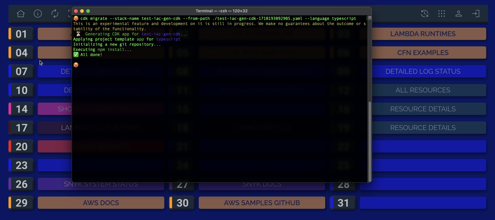

# iac-generator
IaC Generator, a new feature from AWS inside CloudFormation.            
Demo to showcase this latest feature (2024) from AWS.

Now everything what is clicked together in the AWS console can be easily and quickly transformed to managed IaC resources.          
I made a little demo video that takes approximately 4 minutes to watch to showcase this new feature.                

Go to CloudFormation, select the IaC generator, it basically consists of 3 steps:
1. Scan your account resources.
2. Create a CloudFormation Template.
3. Generate a CDK app.

Start a new scan, and wait until it is finished, depending on the number of resources in your account it can be finished in 5 min. but it could also take up to 30 minutes.
The scan is valid for 30 days, meaning that you have to do a new scan after that, because probably some resources in your account have changed.
When the scan is finished It shows the number of resources found.
Which is also a great way to get an overview of all your resources.

Next step is to click create template, choose a name and choose if you want to retain or replace the resources if there is a stack deletion or if the stack is updated.

Select and add your resources to the template, in this case I selected an ECS volume that was manually created. You can see that there is a column in the overview that directly shows if one of your resources is managed by a stack or not.

After selecting the resources the IaC generator adds all related resources to the selection, all resources that are needed to create a deployable stack.

When the template is ready, you can look at the template definition and the resources included in the stack.

The third tab in this field is really awesome, it lets you create a complete deployable CDK app from this template. AWS developed a tool for this called CDK Migrate.
Download the template and run the command provided by AWS, run it inside the folder where you downloaded the template.
As you can see it generates the CDK app and if we open the repository we can do all the CDK stuff immediately, like `cdk synth, cdk diff and cdk deploy`. You can also use the generated resources in your existing repository. CDK migrate creates L1 constructs of your resources.

Another variant on this workflow is CDK Import, which can be used if you want to add existing resources to your existing CDK app but it really depends on your use case.

[CDK Migrate](https://docs.aws.amazon.com/cdk/v2/guide/migrate.html])

[CDK ~Import](https://docs.aws.amazon.com/cdk/v2/guide/use_cfn_template.html])

https://github.com/RobertoTorino/iac-generator/assets/390603/61d9d3df-66fd-437d-95e4-87a4e51d5615

